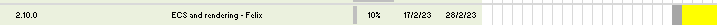
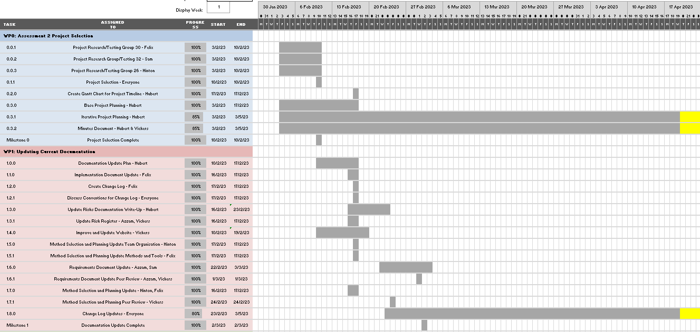

# Assessment 2 Gantt Chart Weekly Snapshots
Right-click images and open in new tab to zoom in

**Note: Each section's images run continuously in the actual gantt chart but have been put on a new line to fit them on the page**

##Final Gantt Chart
[Download link for final gantt chart](images/gantt/Eastera/BCSAssessment2GanttChart.xlsx)

##Spring Week 4

##Spring week 5

##Spring Week 6

Sam Toner was not present for the meetings during this week. 
To mitigate risk R2.1 we took meeting minutes (which are accessible by all team members) 
and updated him on what happened at the end of the week.

##Spring Week 7

##Spring Week 8

- Requirements document update had to be moved to the end of the week to ensure that further requirements were added as they were not detailed enough; 
	- This follows the mitiagtion for risk R2.9 since we allowed malleable deadlines so we could extend task duration as needed.
	- It also follows the mitigation for risk R2.13 since after quality assurance we decided that we needed to add more requirements and be more clear about what was needed
	- It also follows the mitiagtion for risks R2.20 and R2.21 because there were not enough requirements to accuractely describe the system as well as discovering new requirements needed for assessment 2 throughout the week
- Current code base evaluation had to be extended so that the code base could be better understood and the improvements on the code base could be better planned out by the development team
	- This followed the mitigation for Risk R.18
	

##Spring Week 9

##Spring Week 10

- Another risk encountered by not keeping up to date with the change log, must keep up to date with it and ensure that the changes are logged
	- This follows the mitigation for risk R2.13 as we ensured that all changes were logged and enforce quality assurance more often to prevent it happeneing again
- Have changed the end date of the unit test plan, required more time since we wanted to make it easier to read and interact with and so it took longer; also added further tests to the plan
	- This also followed the mitigation for risk R2.13 as we wanted to have a more detailed template to use when starting to write tests
	- Additionally it followed the mitigation for risk R2.9 as we changed the plan

##Easter Break

- Personal issues meant power up and recipe displays got delayed until the end of the project
	- This followed the mitigation for Risk R2.31 as we has a minumum bus factor of 2, 
	meaning someone monitored the task and took on some of the workload themselves until the original owner continued work on it.
- As a result this also delayed a lot of additional deadlines especially for documentation which had to be extended to the end of the project
	- Due to this, we had to adapt the plan to ensure that everything would be completed in time after the delay. This follows the mitigation for risk R2.9
	

##Summer Week 2 & 3

