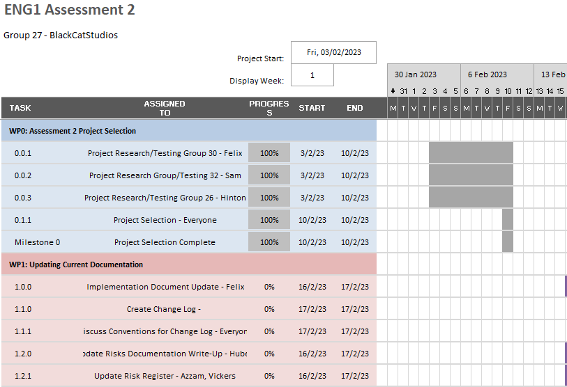
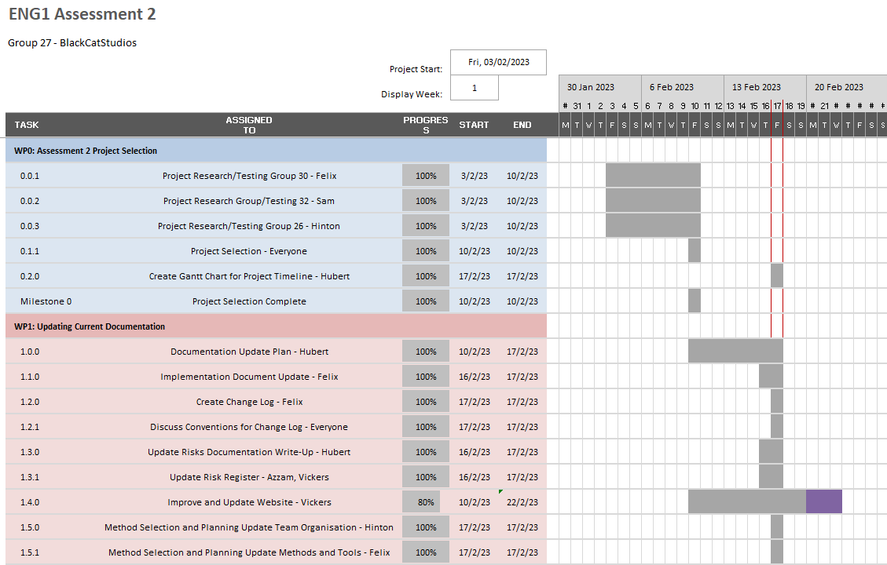
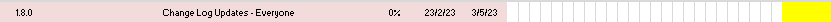
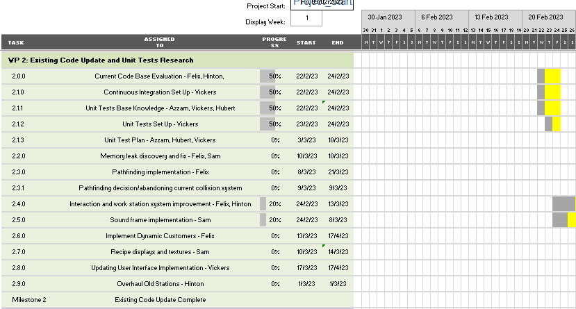

# Assessment 2 Gantt Chart Weekly Snapshots
Right-click images and open in new tab to zoom in

**Note: Each section's images run continuously in the actual gantt chart but have been put on a new line to fit them on the page**

##Final Gantt Chart
[Download link for final gantt chart](images/gantt/BCSAssessment2GanttChart.xlsx)

##Spring Week 4

- At this point in the project, we were deciding what code base to take over for assessment 2.
- We spent most of the week researching and testing other games to decide on which would be the easiest to take over
and the easiest to implement our desired requirements into.
- At this point everyone was present and a plan was being formed for the team by Hubert to have a general idea of timelines and 
tasks that had to be done before the project started properly. The gantt chart was created and minutes had started to be taken to
later verify what had been completed. The plan consisted of a base timeline for when aspects of assessment 2 were to be completed; this 
was further developed in the following weeks becoming more sophisticated after a specific code base was selected and the tasks were adjusted to the needs of the project.
- No risks were encountered since everyone was present and the risks had not yet been properly identified and analysed. The risk identification, analysis 
and mitigation would come in the following weeks after project selection. 
- At this point we completed our first work package and reached our first project milestone.

##Spring week 5

- In this week we focused on analysing the project that we selected, Team Triple10.
- After taking over the project, we managed to communicate with Triple10 to fully take over their documents since not all were easily accessible on their website.
	- Having the risk documentation being updated early in the project as mentioned in the base plan meant that we were able to identify, assign ownership and mitigate such risks and
 prevent them from hurting our project. This risk was R2.19, having difficulties in taking over Triple10's website. We were able to mitigate this by changing the style of the website from HTML to MKDocs to better suit our experience, 
and liasing with the previous team to retrieve all their previous documentation to continue our work and prevent our project from becoming stagnant.
-  We continued to otherwise become familair with Triple10's documentation, which allowed us to analyse their methods and adjust them where needed to fit our needs and experience from our previous assessment.
- Additonally, we created a change log that allowed us to log our changes and justifications as required by the brief, also giving us a history of our updates to look back on when needed.
- After this, we were able to accelerate with out project since we implemented the infrastructure to take over the project smoothly as if it was our own.
- The new code base had also undergone its first evaluation; this aided in further planning of the project since we were able to find out further what was needed to be modified in the code base. This heavily influenced the gantt chart and planning, allowing Hubert to better adjust the team plan to the project.
- We were able to additionally create our repository and integrate our continous integration to ensure that we were keeping with the project brief. A testing environment and rules were also started.
- No further risks were encountered since everyone was present and it was too early in the project to encounter any other risks that were associated with adjusting methods and changing documentation.

##Spring Week 6

- Sam Toner was not present for the meetings during this week. 
	- To mitigate risk R2.1 we took meeting minutes (which are accessible by all team members) 
and updated him on what happened at the end of the week. This would have moved the deadlines of a few of the tasks in the Gantt Chart by a day or two to account for Sam's absence.
- Having split into two teams covering code evaluation and improvement and documenation, we were able to split our workloads to cover more ground within the project. While the risks, requirements and method selection and planning documentation was continuously updated, our development team continued to learn the code base and began improving and implementing new functionality for the game. We had to ensure that the change log continued to be updated to keep on top of our workload and update history, as well as prevent risks from happening with our contingency plan under R2.34, where we kept the change log updated and kept communication high.
- Assets were also started to be created at this point to adjust for our requirements. 

##Spring Week 7

- The team continued to work on their assigned tasks with no further issues this week. Due to the high workload that everyone was experiencing, the group starte to fall a bit behind with the work for the project since it wasn't as urgent as other modules at the time. We therefore had to be wary of risk R2.9 and adjust to the requirements of individual team members by adjusting task deadlines. Due to our method selection, we had a malleable plan which was able to be adjusted by a few days to give individuals the leniency they needed.
- No other issues were encountered and the project continued otherwise as normal. Further implementation was completed and the documentation updates were close to being complete for the time being.

##Spring Week 8

- Requirements document update had to be moved to the end of the week to ensure that further requirements were added as they were not detailed enough; 
	- This follows the mitiagtion for risk R2.9 since we allowed malleable deadlines so we could extend task duration as needed.
	- It also follows the mitigation for risk R2.13 since after quality assurance we decided that we needed to add more requirements and be more clear about what was needed
	- It also follows the mitiagtion for risks R2.20 and R2.21 because there were not enough requirements to accuractely describe the system as well as discovering new requirements needed for assessment 2 throughout the week
- Current code base evaluation had to be extended so that the code base could be better understood and the improvements on the code base could be better planned out by the development team
	- This followed the mitigation for Risk R.18
	

##Spring Week 9

- The team was in the process of creating the sound frame (SAM), creating the required assets (JACK HINTON), implementing stations and dynamic customers. Vickers was also implemting the user inferface. We were making siginicant progress towards our goal of finish some essential components before the easter holiday. 
- One risk we were overcoming was R2.17 as it wasn't clear if we could use the previous teams license at this point and the team was debating purchasing it ourself to prevent legal issues. 
- R2.13 was another issue as some core elements weren't able to be play tested thus we had unidentified bugs in the code at that moment. To mitigate this we ensured we did frequent code reviews and check ups.

##Spring Week 10

- Another risk encountered by not keeping up to date with the change log, must keep up to date with it and ensure that the changes are logged
	- This follows the mitigation for risk R2.13 as we ensured that all changes were logged and enforce quality assurance more often to prevent it happeneing again
- Have changed the end date of the unit test plan, required more time since we wanted to make it easier to read and interact with and so it took longer; also added further tests to the plan
	- This also followed the mitigation for risk R2.13 as we wanted to have a more detailed template to use when starting to write tests
	- Additionally it followed the mitigation for risk R2.9 as we changed the plan
- In this week we made more progress on UI such as implementing a pause menu (Jack Vickers) and were mainly working on finalising the work from the previous week. We starting designing the wave calculations. However near the end of this week we realised we'd need to push back expectations to the next week. 
- One potential risk coming up due to the easter holiday is R2.22, that programmers might become unavalible due to holiday. The other risk is R2.23, due to the fact we would be seperated for the next few weeks, development might end up going off on a tangent. To manage this we made sure to have regular meetings on discord and communicate what each one of us were doing over the last few days.

##Easter Break

- Personal issues meant power up and recipe displays got delayed until the end of the project
	- This followed the mitigation for Risk R2.31 as we has a minumum bus factor of 2, 
	meaning someone monitored the task and took on some of the workload themselves until the original owner continued work on it.
- As a result this also delayed a lot of additional deadlines especially for documentation which had to be extended to the end of the project
	- Due to this, we had to adapt the plan to ensure that everything would be completed in time after the delay. This follows the mitigation for risk R2.9
	

##Summer Week 2 & 3

- The workload of individuals was especially high in these last weeks due to the many projects and revision that everyone was undertaken during the Summer term. R2.9 was especialy prevalent in these weeks for this reason and so the Gantt Chart and the plan underwent significant modification to allow for all these changes and needs of the team members. Sam needed extra time to finish his power up implementation and UI, as well as his architectural documentation updates and so needed an extension to the end of the project. The same was required for testing and bug fixes for the entire code base since more and more bugs were continuously found. Manual tests were especially needed towards the end of the project and so not only was the deadline extended, but a higher bus factor was implemented to ensure that it was not forgotten.
- R2.13 was a serious risk that had to be considered in this case and we needed to make sure that we were aware of our contingency plan of good communication, honesty and teamwork as well as quality assurance to ensure that the quality of our work was not suffering.
- We further encountered code style and naming convention issues which had to be fixed and later added to the gantt chart due to R2.14 as an extra task. We knew this was an issue from our assessment 1 feedback and so made sure that this was rectified before the project was handed in. 
- We were also able to test the game on different operating systems ensuring that it ran on Linux and MacOS as well as Windows which was a success.
- R2.32 was also improved upon by increasing the output of the tests that we were doing since we wanted this to be higher. We therefore had to extend our deadline on the completion of tests till the end of the project to increase our coverage.
- At this point, after a larger workload regarding the project and a lot of updates occurring in the gantt chart, we were able to complete the project and successfully hand it in in time; we were satisfied with out work and happy to meet all the requirements as well as complete the work to the best of our ability. This was further verified by quality assurance at the end of the project of all work.