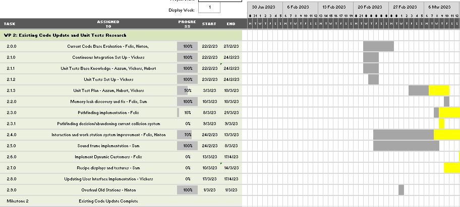
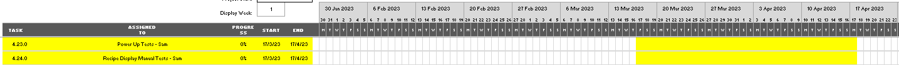

#Gantt Chart Weekly Snapshots

##Spring Week 4

##Spring week 5

##Spring Week 6

Sam Toner was not present for the meetings during this week. 
To mitigate risk R2.1 we took meeting minutes (which are accessible by all team members) 
and updated him on what happened at the end of the week.

##Spring Week 7

##Spring Week 8

Requirements document update had to be moved to the end of the week to ensure that further requirements were added as they were not detailed enough; find risk mitigated with this

##Spring Week 9

##Spring Week 10

##Easter Break

##Summer Week 2 & 3

